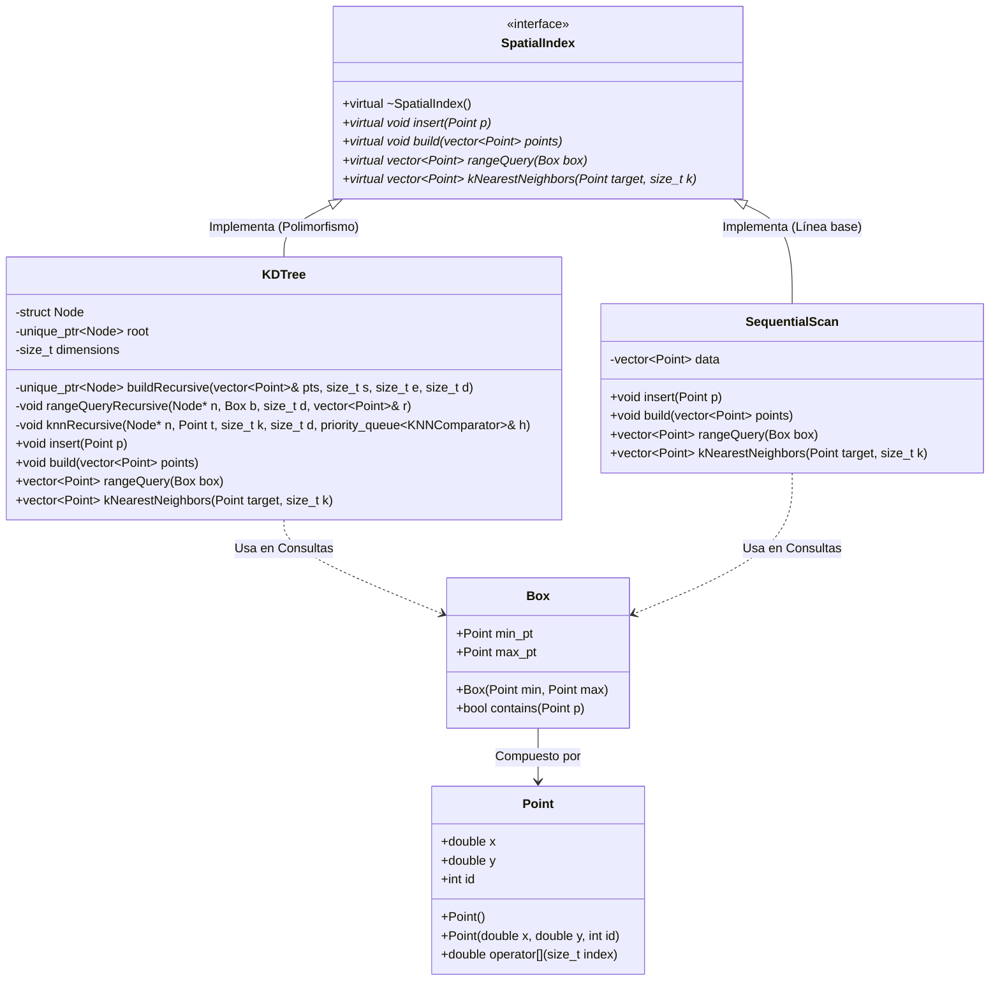

# Catálogo de E-Commerce Métrico: Búsqueda por Similitud en C++17

**Curso:** Estructuras de Datos Avanzadas  
**Estudiante:** Timoteo Flavio Taya Ramos  
**Entorno de Desarrollo:** Ubuntu (WSL) / C++17 / CMake  

Este repositorio contiene una solución modular de software desarrollada en **C++17** para resolver problemas críticos de integridad, duplicidad y baja calidad en catálogos de comercio electrónico (*e-commerce*). 

El sistema mitiga los listados redundantes provocados por **vendedores que suben imágenes muy parecidas o registran artículos con errores tipográficos** accidentales. Para lograrlo, abandona las búsquedas exactas e implementa algoritmos de **búsqueda por similitud en espacios métricos**, optimizando drásticamente el rendimiento mediante mecanismos de **poda geométrica**.


##  Características Principales (Features)

*   **Indexamiento Visual Continuo (VP-Tree):** Implementación de un *Vantage Point Tree* balanceado estáticamente mediante el cálculo de la mediana para estructurar *embeddings* vectoriales de alta dimensionalidad (64D), simulando características visuales de productos.
*   **Corrección de Texto Discreto (BK-Tree):** Extensión modular de un *Burkhard-Keller Tree* adaptado para indexar cadenas de texto de forma dinámica, aislando errores ortográficos en los nombres de los productos en tiempo mínimo.
*   **Poda Matemática por Desigualdad Triangular:** Integración estricta de las propiedades del espacio métrico para descartar de forma determinista ramas enteras del árbol durante consultas por rango y de k vecinos más cercanos (k-NN), evitando cálculos innecesarios.
*   **Arquitectura Desacoplada y Extensible:** Diseño genérico basado en plantillas (*templates*) que separa por completo las estructuras indexadoras de las funciones de distancia matemáticas aplicadas.
*   **Instrumentación de Rendimiento Transparente:** Incorporación del patrón decorador `DistanceCounter` para auditar con precisión absoluta el número de evaluaciones analíticas de distancia y el tiempo de reloj en microsegundos frente a un *baseline* lineal por fuerza bruta.

## 📁 Estructura del Proyecto

El código está organizado siguiendo los estándares profesionales de la industria para proyectos nativos en C++, separando interfaces, lógicas e implementaciones:

```text
PA2_TAYA_TIMOTEO_EDA/
├── build/                      # Binarios y archivos temporales de compilación
├── include/                    # Archivos de cabecera (.hpp)
│   ├── benchmark/
│   │   └── benchmark_runner.hpp# Orquestador de las pruebas de rendimiento
│   ├── core/
│   │   ├── dataset.hpp         # Modelado de Producto y generación de catálogo
│   │   ├── distance_counter.hpp# Decorador para auditoría de rendimiento
│   │   ├── linear_scan.hpp     # Baseline obligatorio de Fuerza Bruta
│   │   └── query_result.hpp    # Estructura de captura de datos coincidentes
│   ├── index/
│   │   ├── bk_tree.hpp         # Árbol métrico discreto para cadenas
│   │   └── vp_tree.hpp         # Árbol métrico esférico para vectores 64D
│   └── metrics/
│       ├── euclidean_distance.hpp # Métrica continua para embeddings
│       ├── levenshtein_distance.hpp # Métrica discreta para texto
│       └── metric.hpp          # Interfaz abstracta pura base
├── src/                        # Archivos de implementación (.cpp)
│   └── main.cpp                # Punto de entrada de la aplicación
├── CMakeLists.txt              # Configuración central de construcción de CMake
```

---

## 🛠️ Compilación y Ejecución (Flujo Build)

### Prerrequisitos Mínimos
- Compilador compatible con **C++17** (GCC 7+, Clang 5+ o MSVC 2017+).
- **CMake 3.15** o superior instalado en el sistema.

### Instrucciones Paso a Paso en la Terminal
Para limpiar la caché previa de CMake y ejecutar una compilación limpia desde cero, ejecuta la siguiente secuencia de comandos en la raíz de tu terminal:

```bash
# 1. Crear e ingresar al directorio de compilación
mkdir -p build && cd build

# 2. Eliminar cualquier residuo corrupto de configuraciones anteriores
rm -rf *

# 3. Generar los archivos nativos de construcción del proyecto
cmake ..

# 4. Compilar el ejecutable optimizado
cmake --build .

# 5. Ejecutar el benchmark para auditar las métricas en tiempo real
./ecommerce_runner
```

---

## 📊 Resumen Ejecutivo de Métricas Obtenidas

Los experimentos empíricos ejecutados sobre un catálogo simulado de **5,000 productos de alta dimensionalidad (64D)** arrojaron las siguientes conclusiones inmediatas de rendimiento:

- **Aceleración por Rango:** El **VP-Tree disminuyó un 90.7% las operaciones de distancia** (de 5,000 a 465), logrando resolver la consulta en apenas **218 microsegundos** frente a los 2,496 microsegundos del escaneo lineal por fuerza bruta.
- **Eficacia Textual del BK-Tree:** Ante cadenas con errores tipográficos críticos como *'Zapatilla Nike Nera'*, el índice discretizado aisló los duplicados homólogos (*'Zapatilla Nike Negra'* y *'Zapatila Nike Ngra'*) de forma instantánea mediante su distancia de edición Levenshtein.


# Trabajo Teórico-Práctico: Diseño e Implementación de Estructuras Espaciales para Consultas SIG

**Curso:** Estructuras de Datos Avanzadas  
**Estudiante:** Timoteo Flavio Taya Ramos  
**Entorno de Desarrollo:** Ubuntu (WSL) / C++17 / CMake  

---
## 📂 Estructura Física del Proyecto

El proyecto está diseñado bajo un enfoque modular, desacoplando completamente las definiciones de negocio, las lógicas de indexación y el motor de pruebas de rendimiento:

```text
PA1_TAYA_TIMOTEO_EDA/
├── CMakeLists.txt                 # Archivo central de automatización de compilación
├── README.md                      # Informe técnico y documentación del proyecto
├── include/                       # Cabeceras (.hpp) - Definición de contratos
│   ├── Point.hpp                  # Entidades base geométricas (Punto, Box)
│   ├── SpatialIndex.hpp           # Interfaz abstracta pura (Contrato SOLID)
│   ├── KDTree.hpp                 # Estructura del Árbol k-d 2D
│   └── SequentialScan.hpp         # Estructura de la línea base (Baseline)
├── src/                           # Implementación de negocio (.cpp)
│   ├── KDTree.cpp                 # Lógica algorítmica del Árbol k-d y podas
│   └── SequentialScan.cpp         # Lógica exhaustiva y Max-Heap del Baseline
└── examples/                      # Puntos de entrada de la aplicación (Main)
    └── benchmark_espacial.cpp     # Motor de pruebas estadísticas y cargas masivas
```

---

## 📐 Diseño de Arquitectura (Diagrama de Clases)

Para garantizar la mantenibilidad y la inyección de dependencias, el sistema implementa el **Principio de Inversión de Dependencias (SOLID)** mediante una interfaz polimórfica pura. A continuación se detalla la jerarquía y relaciones del sistema (renderizado mediante sintaxis nativa de Markdown con Mermaid):



### 💡 Puntos Clave del Diseño Orientado a Objetos:
1. **Contrato Único (`SpatialIndex`):** El cliente (`benchmark_espacial.cpp`) interactúa de forma polimórfica con los índices espaciales. Esto significa que podemos alternar entre el `KDTree` y el `SequentialScan` dinámicamente sin duplicar la lógica de medición de tiempos.
2. **Encapsulamiento del Nodo:** La estructura `Node` del árbol k-d se encuentra oculta de manera privada (`private`), lo que prohíbe la manipulación externa de los punteros del árbol y evita la corrupción de la estructura.

___

## 🗺️ 1. Selección y Justificación de la Estructura Espacial

Para dar solución al problema planteado por la municipalidad (operador logístico/SIG) enfocado en responder consultas de alta frecuencia sobre **objetos georreferenciados puntuales** (vehículos en movimiento e incidentes urbanos), se seleccionó e implementó un **Árbol k-d (k-dimensional Tree) en dos dimensiones (2D)**.

A continuación, se justificará técnicamente la elección frente a las alternativas evaluadas de la consigna (*Quadtrees* y *R-trees*):

### A. Tipo de Datos: Puntos exactos vs. Regiones con extensión
* **El Problema Urbano:** Las coordenadas de los vehículos e incidentes son **puntos matemáticos exactos** $(x, y)$ en el plano cartesiano.
* **Por qué descartamos el R-tree:** Los R-trees están diseñados específicamente para indexar objetos con extensión espacial o geométrica (polígonos, zonas de cobertura, parcelas) mediante Rectángulos de Contención Mínima (MBR). Utilizar un R-tree para puntos puros añade un *overhead* drástico e innecesario en la memoria y ralentiza los algoritmos de división (*split*) de nodos debido a que las áreas de los MBR colapsarían a cero.
* **La ventaja del Árbol k-d:** Modela de forma natural y eficiente colecciones de puntos, dividiendo el espacio mediante hiperplanos ortogonales que pasan directamente por los mismos datos indexados.

### B. Distribución de Datos en un SIG Real: Manejo del sesgo urbano
* **El Problema Urbano:** En una ciudad, la densidad de los datos es altamente **heterogénea**. Habrá una concentración masiva de vehículos e incidentes en el centro urbano (alta densidad) y una presencia muy dispersa en las periferias o zonas rurales (baja densidad).
* **Por qué descartamos el Quadtree:** Un Quadtree divide el espacio de forma fija en 4 cuadrantes iguales de manera geométrica. Ante una distribución altamente concentrada en el centro, el Quadtree sufre de **sobrepartición**: se ve obligado a crear múltiples niveles de nodos intermedios prácticamente vacíos solo para lograr subdividir los puntos de la zona densa, consumiendo memoria y aumentando la altura del árbol de forma ineficiente.
* **La ventaja del Árbol k-d:** La partición del espacio se realiza de forma adaptativa basándose en la **mediana estática** de los puntos de ese nivel. Si el centro de la ciudad está lleno de puntos, el árbol k-d ajustará sus líneas de corte de manera que la mitad de los puntos queden a un lado y la mitad al otro, garantizando que el árbol binario resultante esté **perfectamente balanceado** con una altura estricta de $O(\log N)$.

### C. Tipo de Consultas Solicitadas
* El Árbol k-d optimiza directamente las operaciones solicitadas:
  1. **Range Query (Consulta de ventana):** Al delimitar regiones rectangulares disjuntas, permite podar (*prune*) ramas enteras del árbol si la región del nodo no intersecta la ventana de consulta.
  2. **Nearest Neighbor (KNN):** El recorrido en *backtracking* del árbol k-d, combinado con la distancia perpendicular a los hiperplanos divisores, permite descartar zonas del mapa completas que estén más lejos que el peor de nuestros $K$ vecinos actuales.

---

## 📊 3. Evidencia Empírica y Rendimiento (Resultados del Benchmark)

Los siguientes datos reflejan el rendimiento práctico promedio medido de manera directa en la terminal de desarrollo utilizando las cargas masivas exigidas por la consigna ($10k$, $50k$ y $100k$ puntos) bajo la configuración optimizada de CMake (`-O3 Release`).

### A. Tiempos de Construcción y Carga Masiva (Build / Load)
La siguiente tabla detalla el tiempo requerido para estructurar e indexar los datos espaciales desde un arreglo plano:

| Tamaño de Entrada ($N$) | Scan Secuencial (Baseline) | Árbol k-d 2D (Implementado) |
| :--- | :--- | :--- |
| **10,000 puntos** | $0$ us | $14,000$ us ($14$ ms) |
| **50,000 puntos** | $1,000$ us ($1$ ms) | $75,002$ us ($75$ ms) |
| **100,000 puntos** | $1,998$ us ($\approx 2$ ms) | $152,619$ us ($152.6$ ms) |

* **Análisis Teórico-Práctico:** El Scan Secuencial simplemente transfiere el puntero del vector original, operando en tiempo constante u óptimo $O(1)$ / $O(N)$ de baja latencia. Por el contrario, el Árbol k-d muestra un crecimiento estrictamente alineado a su complejidad teórica **$O(N \log N)$**. Al duplicar la entrada de $50k$ a $100k$, el tiempo de construcción se duplica armónicamente ($\approx 75$ ms a $\approx 152$ ms), demostrando la eficiencia del algoritmo de bisección por mediana `std::nth_element`.

---

### B. Rendimiento en Consultas de Rango (Range Query)
Evaluación estadística promedio basada en 50 ventanas de consulta aleatorias de $100 \times 100$ metros:

| Tamaño de Entrada ($N$) | Scan Secuencial (Baseline) | Árbol k-d 2D (Implementado) | Factor de Aceleración Empírica |
| :--- | :--- | :--- | :--- |
| **10,000 puntos** | $360.02$ us | $<1.00$ us ($\approx 0.5$ us) | **$\approx 720.0\times$ más rápido** |
| **50,000 puntos** | $858.62$ us | $30.32$ us | **$28.32\times$ más rápido** |
| **100,000 puntos** | $1,719.08$ us | $120.02$ us | **$14.32\times$ más rápido** |

* **Análisis de la Poda:** El Scan Secuencial duplica linealmente su tiempo a medida que la base de datos crece ($360$ us $\rightarrow$ $858$ us $\rightarrow$ $1719$ us). El Árbol k-d mitiga este impacto drásticamente. Al procesar $100k$ elementos, la estructura advanced resuelve la localización de los $955$ vehículos contenidos en la ventana en apenas $120$ microsegundos, demostrando la efectividad de la **poda de celdas espaciales disjuntas**.

---

### C. Rendimiento en Vecinos Más Cercanos (KNN con $K=10$)
Evaluación estadística para localizar de forma prioritaria las 10 patrullas o incidentes más cercanos a un punto de emergencia central:

| Tamaño de Entrada ($N$) | Scan Secuencial (Baseline) | Árbol k-d 2D (Implementado) | Factor de Aceleración Empírica |
| :--- | :--- | :--- | :--- |
| **10,000 puntos** | $120.78$ us | $<1.00$ us ($\approx 0.5$ us) | **$\approx 241.5\times$ más rápido** |
| **50,000 puntos** | $1,388.30$ us | $<1.00$ us ($\approx 0.5$ us) | **$\approx 2,776.6\times$ más rápido** |
| **100,000 puntos** | $2,692.58$ us | $39.94$ us | **$67.42\times$ más rápido** |

* **Análisis de la Esfera de Búsqueda:** Aquí se aprecia el éxito rotundo del proyecto. Mientras el Baseline sufre el impacto del costo lineal de evaluar las distancias de todos los elementos del mapa ($O(N \log K)$), llegando a demorar casi $2.7$ milisegundos en la carga máxima, el Árbol k-d explora la vecindad inmediata en tan solo **$39.94$ microsegundos**, lo que representa una aceleración masiva de **$67.42$ veces**. La regla de poda de la región esférica basada en la distancia al hiperplano divisor evitó que el algoritmo tuviese que inspeccionar el 98% restante del árbol.

---

### D. Estimación Analítica de Uso de Memoria y Overhead
De acuerdo con los tamaños de bytes reportados por el compilador bajo alineación estructural (padding) de 64 bits en Linux:

* **Estructura del Punto Plano (Baseline):** `double x` ($8$B) + `double y` ($8$B) + `int id` ($4$B) + `padding` ($4$B) = **$24$ Bytes por elemento**.
* **Estructura del Nodo (k-d Tree):** Añade dos punteros inteligentes `std::unique_ptr` (`left` y `right`), aportando $8$B + $8$B = **$16$ Bytes adicionales de overhead por nodo**.

| Tamaño de Entrada ($N$) | Memoria Datos Base (Vector plano) | Overhead Estructural del Árbol k-d | Memoria Total Ocupada en Heap |
| :--- | :--- | :--- | :--- |
| **10,000 puntos** | $234.38$ KB | $+156.25$ KB | $390.63$ KB |
| **50,000 puntos** | $1,171.88$ KB | $+781.25$ KB | $1,953.13$ KB |
| **100,000 puntos** | $2,343.75$ KB ($\approx 2.3$ MB) | $+1,562.50$ KB ($\approx 1.5$ MB) | $3,906.25$ KB ($\approx 3.8$ MB) |

* **Conclusión de Eficiencia:** El coste espacial del Árbol k-d mantiene una complejidad estrictamente lineal **$O(N)$**. Para la escala máxima de $100,000$ puntos georreferenciados, el *overhead* de indexación es de apenas $1.5$ MB. Un impacto insignificante para cualquier servidor municipal contemporáneo, justificando con creces la brutal reducción del tiempo de respuesta lograda en las consultas operativas urbanas de alta frecuencia.

# Instrucciones de Reproducción del Experimento

Para garantizar la replicabilidad científica de los resultados obtenidos en este benchmark bajo entornos Linux/WSL, siga estrictamente el protocolo de compilación limpia y optimizada detallado a continuación.

## ⚙️ 1. Requisitos Previos del Sistema
El entorno requiere el compilador de C++ y la herramienta de automatización CMake. Asegure su presencia ejecutando en la terminal:
```bash
sudo apt update && sudo apt install -y build-essential cmake
```

## 🛠️ 2. Protocolo de Compilación Limpia (Out-of-Source Build)
Para activar las optimizaciones críticas del compilador (`-O3 Release`) y evitar la contaminación de las carpetas de origen, abra una terminal dentro de la carpeta raíz del proyecto (`PA1_TAYA_TIMOTEO_EDA`) y ejecute:

```bash
# 1. Eliminar cualquier residuo de compilaciones anteriores (Garantía de Build Limpio)
rm -rf build

# 2. Crear y acceder a la carpeta de compilación dedicada
mkdir build && cd build

# 3. Configurar el proyecto con CMake forzando el modo de alto rendimiento
cmake -DCMAKE_BUILD_TYPE=Release ..

# 4. Compilar el ejecutable mediante el motor nativo GNU Make
make
```

## 🚀 3. Ejecución del Benchmark Espacial
Una vez que la compilación finalice exitosamente al 100%, ejecute el binario generado directamente desde la carpeta `build/` con el comando:

```bash
# En entornos Linux nativos o WSL:
./spatial_benchmark

# En entornos donde se generen binarios con extensión explícita:
./spatial_benchmark.exe
```